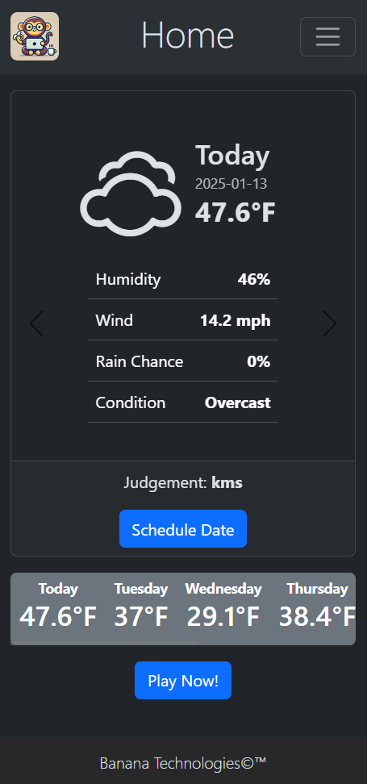
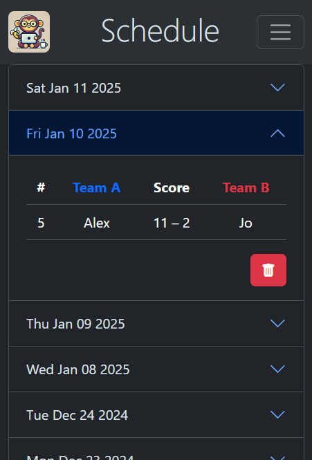
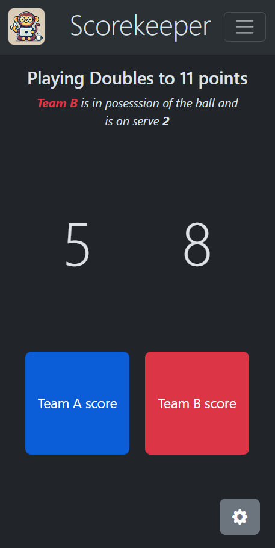
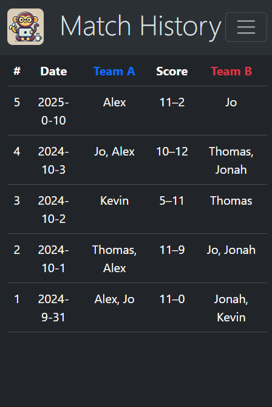
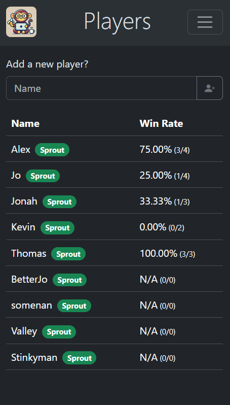

# Pickleball Weather App

Welcome to the Pickleball Weather App!

## Features

### Homepage

- Shows the weather
- Assesses the optimal days to play pickleball using dynamically loaded weather forecast
- Allows scheduling of days to play

### Schedule

- Displays the days you've scheduled to play
- Shows the games you play on those scheduled days
- Allows deletion of scheduled days

### Scorekeeper

- Keeps track of a game's state
  - Custom game rules
  - Team score
  - Ball possession
  - Players on each team
  - Tells you when someone wins
- If there are players, the match data is saved to our database

### Matches

- Displays a table of all the matches we store

### Players

- Lists all of the registered players
- Allows adding new players
- Shows player stats like winrate and titles that are computed based on their stats

## Pictures!











## Cool Developments and Technologies in this project

- Next JS (React JS)
- Bootstrap
- Responsive Design (Desktop + Mobile view)
- Typescript
- Project-wide formatting and linting rules
- Dockerized development environment dependencies
- Parameterized environment variables
- Frontend and backend validation
- Stores data in PostgreSQL
- Many refactors along the way
- CDK automated deployment
- Deployed onto AWS EC2 using CDK/Cloudformation

## Deployment Instructions

1. Install AWS CDK CLI
2. Log into AWS CLI
3. cd into banana-infrastructure directory
4. Bootstrap `cdk bootstrap`
5. Deploy! `cdk deploy`

## Spinning up the Environment

### Required Software

- NodeJS
- Docker

### Creating our Database

Spin up a PostgreSQL database using docker. Make sure the values in the .env file match the values you set up the database with.

```sh
POSTGRES_DB={POSTGRES_DB}
POSTGRES_USER={POSTGRES_USER}
POSTGRES_PASSWORD={POSTGRES_PASSWORD}
POSTGRES_HOST=localhost
POSTGRES_PORT=5432
POSTGRES_SSL_ENABLED=false
```

### Starting NextJs

Install the node modules in the `/next-app` directory and run the server

`npm ci`
`npm run start`

🐵
